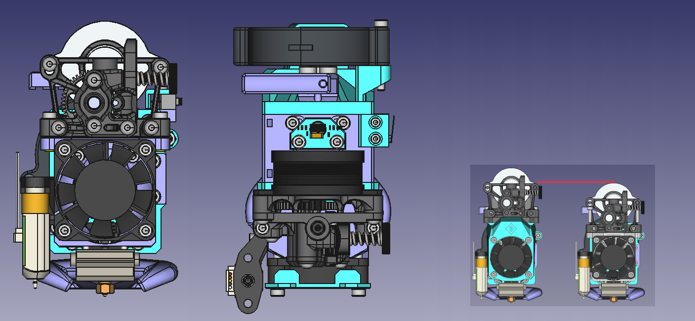

# SnakeOilXY and EVA2 toolhead for Sherpa mini

- This mounter was made for our [SnakeOil XY](https://github.com/ChipCE/SnakeOil-XY) corexy printer, but also compatible with EVA2 eco system.
- By moving the mount point from top plate to front plate, this mount method will have 16mm shorter filament path and lower center of mass compare to standard EVA mount.
- Optional slot to mount ADXL345 sensor on top plate.
- This mount reqquire M3xD4.2xL4.0 heatset thread insert.
- Only mosquito, Dragon and cooper head hotend are supported.