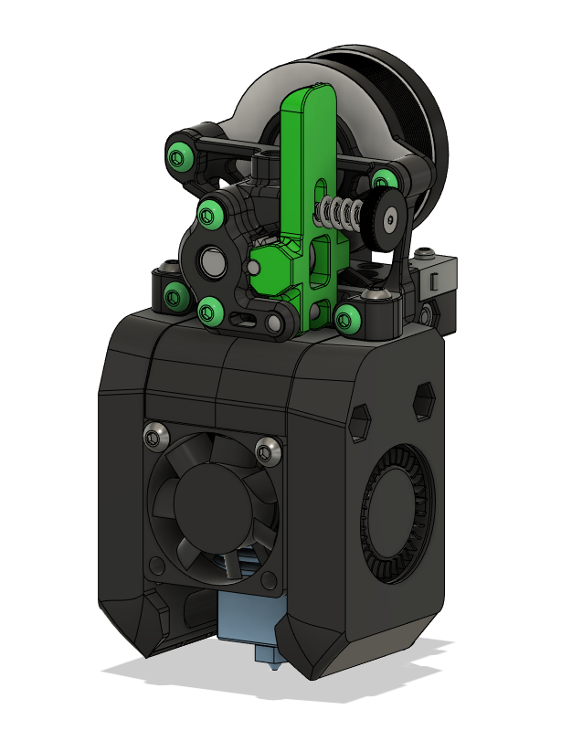

# V0 Toolhead for Sherpa Mini - Alpha 1

This is a toolhead to mount the Sherpa Mini Extruder as a direct drive extruder on the V0. It has been untested currently and is considered **extremely experimental**. CAD files for the toolhead has been included if you wish to tinker with it.

It reuses all the same fasteners and parts from the original V0 toolhead. Sherpa mini parts can be found in our [sourcing guide](https://docs.google.com/spreadsheets/d/1O3eyVuQ6M4F03MJSDs4Z71_XyNjXL5HFTZr1jsaAtRc/htmlview#). You will only need the following extra parts to mount the Sherpa mini to the toolhead:

- 2x Heatset inserts (3x5x4mm)

