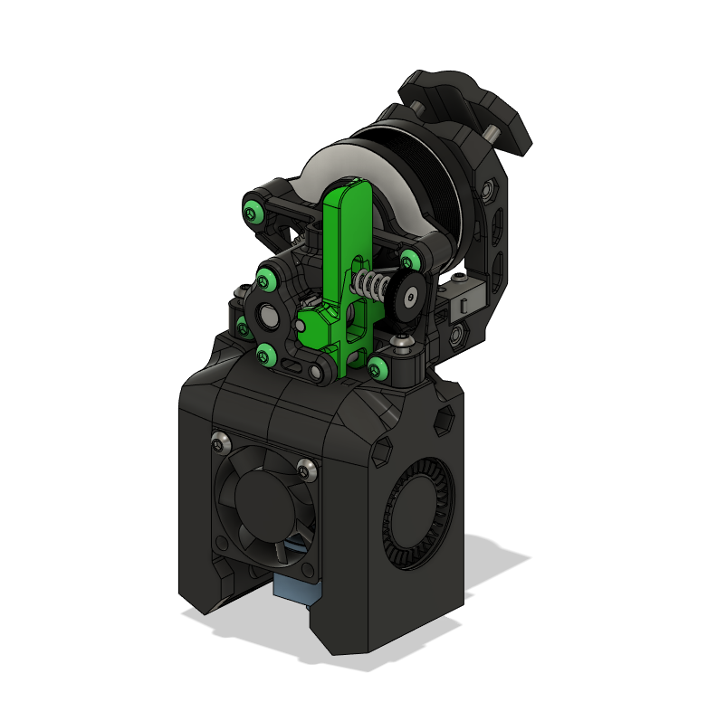

# V0 Toolhead for Sherpa Mini - Beta 1

This is Beta 1 release of the V0 toolhead to mount the Sherpa Mini Extruder as a direct drive extruder. Compared to the Alpha 2, the changes in this release are:

- Sherpa Mini is lowered 2mm closer to the hotend, reducing the distance between the extruder and hotend as well as the total height of the assembly slightly.
- New umbilical strain relief with options to use a printed clamp that screws together or zipties. Compared to the previous versions, this provides a lot more support as well as much more room to work with. The 30° angle forwards provides more bending radius for the umbilical cable when the toolhead is at Y max/rear.
- More ziptie points as well as small tweaks to make them less prone to breaking.

Stock fan ducts are available and the CAD files for the toolhead has been included if you wish to tinker with it (feel free to add your . For the length of the bowden tube between the sherpa mini and the hotend, use the following lengths as a starting point:

- V6 Threaded: **39mm**
- Mosquito: **23mm**
- Dragon: **24mm**

You will need a [Sherpa Mini](https://github.com/Annex-Engineering/Sherpa_Mini-Extruder) and its parts can be found in our [sourcing guide](https://docs.google.com/spreadsheets/d/1O3eyVuQ6M4F03MJSDs4Z71_XyNjXL5HFTZr1jsaAtRc/htmlview#). It reuses all the same fasteners and parts from the original V0 toolhead with exception of the following extra parts:

- 4x Heatset inserts (3x5x4mm) (2x only needed if using ziptie to provide strain relief to umbilical cable.)
- 2 M3x16mm bolts (optional)

*Note: There is no direct comparison between the stock fan duct and the focussed fan duct yet. However, the focussed fan duct has been tested and works well in my setup.*

You may want to assembled your nema 14 motor such that the wires exit from beneath the sherpa mini, creating a more neater look. 