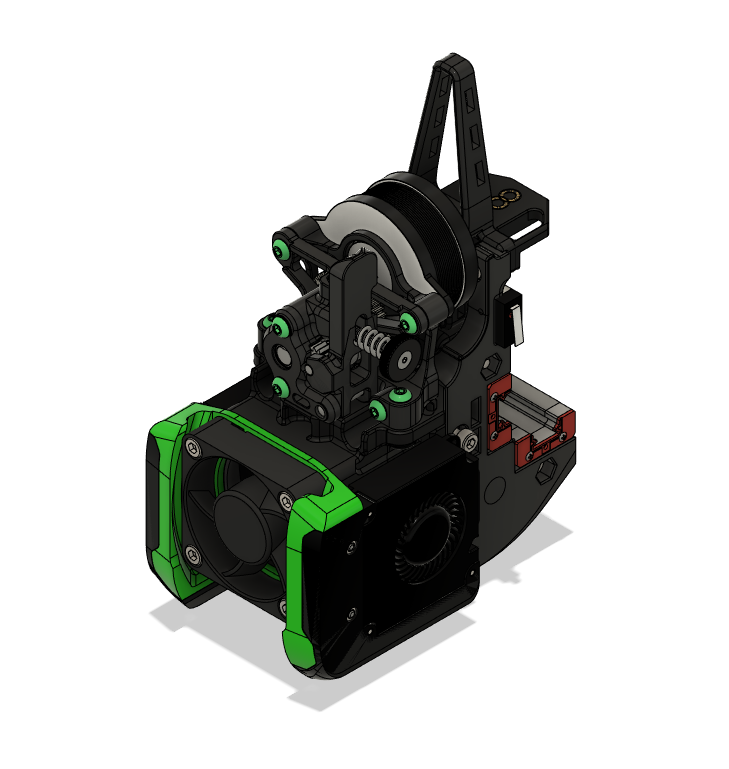

# V2.2 Toolhead for Sherpa Mini - Release 1

This is a toolhead and X carriage for the Sherpa Mini Extruder based off the original V2.2 design. It is a dual rail variant. It has been tested to fit in V2.2 gantry; in CAD, it just fits in a V2.4/V1.8 assembly and you will need to check accordingly if the blower fans may interfere with the xy joints in your printer build.

Currently, it supports the Dragon Hotend only. Probe options include the Omron probe and the Magnetic Microswitch probe from Annex. There is also an option that is compatible with Denali/V1.8 gantry; you need only choose and print the right X carriage for these printers.

## Parts Required

Refer to our [sourcing guide](https://docs.google.com/spreadsheets/u/1/d/1O3eyVuQ6M4F03MJSDs4Z71_XyNjXL5HFTZr1jsaAtRc/htmlview#) for recommended vendors. The eDrawings also allows you to view the assembly and parts.

- 2x M3X16mm SHCS
- 1x M3X20mm SCHS (for Omron X-Carriage only)
- 4x M3X12mm SCHS
- 2x M3X16mm SHCS
- 3x M3x30mm SHCS (4x for Omron X-Carriage)
- 6x M3X8mm SHCS
- 4X M3X6mm BHCS
- 10x M2X8mm self tapping screws (add 2x for Denali/V1.8 carriage only, to mount the microswitch)
- 2x M3 OpenBuilds M3 Tee Nuts (for belt clamps)
- 6x M3 nuts
- 10X Heatset Inserts (3x5x4mm)
- 1x 4010 axial fan (hotend cooling)
- 2x 4010 blower fan (parts cooling)
- 1x Omron TL-Q5MC2 probe
- 4x 3x6mm magnets (for magnetic microswitch carriage only)
- Wire connectors of your choice

