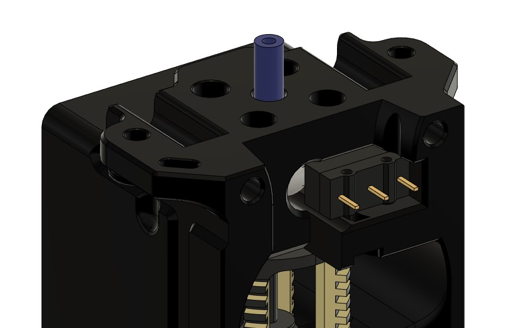
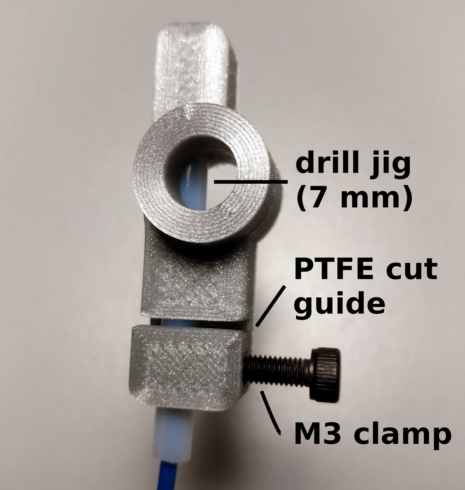
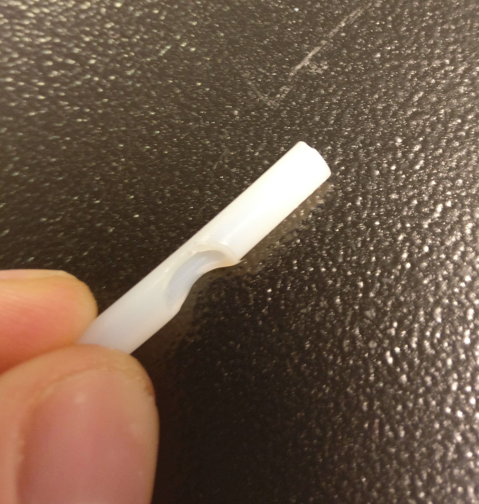

# Voron V2.2 Filament Load Sensor Toolhead
This is a modified version of the EdwardYeeks_Voron2.2 toolhead for the Dragon
hotend.

Integrates a microswitch filament
loading sensor for use with filament-swapping multi-material systems such as the
[Enraged Rabbit Project](https://github.com/EtteGit/EnragedRabbitProject), or
[Prusa MMU](https://www.prusa3d.com/original-prusa-i3-multi-material-2-0/). Use
with the [ECAS retainer housing core Sherpa Mini mod](https://github.com/Annex-Engineering/Sherpa_Mini-Extruder/tree/master/User_Mods/Housing_Core_with_ECAS_coupler) for more reliable automated 
filament loading.

----------------------
## BOM
### Filament sensor specific BOM items:
- 1 × 7 mm steel ball bearing
- Omron D2F-5L microswitch or equivalent
- 2 × M2x12 screws
- 2 × M2 nuts
- 4 mm OD PTFE tubing, >35 mm

### Required tools:
- 7 mm twist drill, sharp
- M3 bolt (for PTFE jig)
- Razor blade / scalpel / box cutter
- Piece of filament

## PTFE Tube Preparation

Use the `dragon_PTFE_jig.stl` to cut a scallop into the PTFE guide for the
filament sensor ball:
1. Cut one end of 4mm OD PTFE tubing square
2. Insert cut end into the jig all the way
3. Insert piece of filament to support the tubing (gives a cleaner cut)
4. Use an M3 screw to clamp the tubing in place securely (prevents rotation)
5. Drill out the PTFE tubing w/ filament inside using the guide hole
6. Cut the PTFE tube to length using the cut guide slot
7. Remove M3 clamp bolt and push the cut piece out using the pinhole at the end
of the jig

## Toolhead Assembly
1. Remove the built-in support along the backside of the toolhead
2. Install the Dragon hotend
3. Insert the scalloped and cut PTFE tube, shorter side down (it's helpful to mark the side with the cutout using e.g. a marker near the top of the tube)
4. Insert the 7 mm steel ball
5. Install the microswitch, lever side towards the center
6. Insert the M2 bolts and nuts and loosely tighten
7. Adjust the microswitch such that it just barely triggers with a piece of filament in the PTFE tube. Be sure to rotate the filament as the curve can cause it to trigger in one rotation and not in another
8. Tighten both M2 bolts once satisfied.
9. Double check adjustment.
10. Continue assembly per usual.