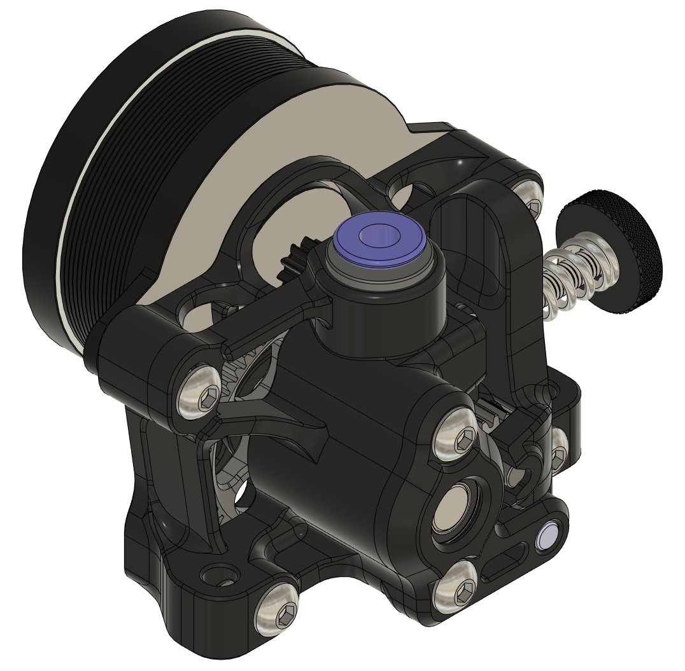

# Housing Core with ECAS Coupler

`housing_core_ECAS` modifies the housing core to recieve an ECAS coupler for 
more positive PTFE tubing retention.

`housing_core_ECAS_MM` also embiggens the filament inlet hole to permit more
reliable automated filament loading with e.g. MMU- or ERCF-style filament
exchange systems.

ECAS04 coupler sourcing examples:
-   Trianglelabs https://www.aliexpress.com/item/32934148155.html
-   Decoprint3D https://decoprint-3d.com/en/collections/extruder/products/extruder-embedded-collet-clips

